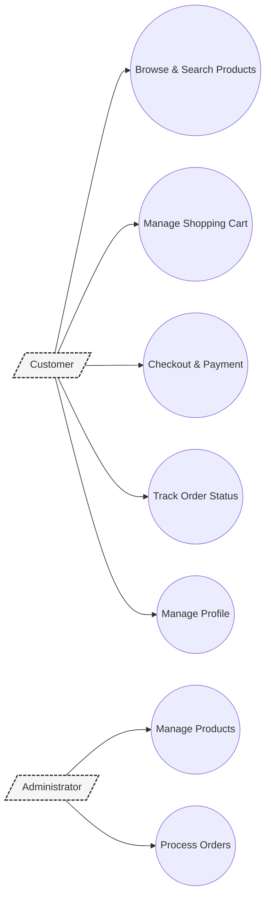
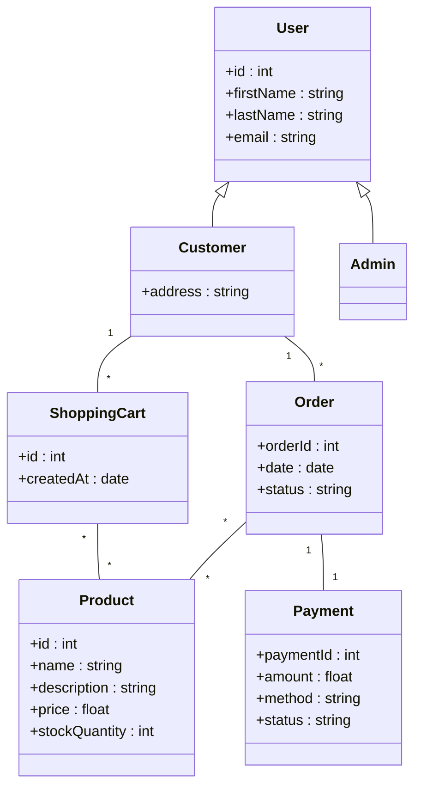

| Étape | Tâche | Détail |
| --- | --- | --- |
| 1️⃣ | **Choisir un cas d’étude** | E-commerce, santé, IoT… |
| 2️⃣ | **Créer un CIM** | Use cases, exigences métier |
| 3️⃣ | **Créer un PIM** | Modèle UML (classes, activités…) |
| 4️⃣ | **Créer 2 PSMs** | Exemple : un en Java, un en Web |
| 5️⃣ | **Générer du code** | Automatiser avec EMF, MagicDraw, ou autre |
| 6️⃣ | **Implémenter un prototype** | App fonctionnelle simple |
| 7️⃣ | **Documenter le tout** | Rapport sur chaque étape, transformations, outils utilisés |

- BPMN Shopmax

### lasses principales à modéliser :

- `User` (`Customer` et `Admin` peuvent en hériter)
    - `id`, `name`, `email`
- `Product`
    - `id`, `name`, `description`, `price`, `stockQuantity`
- `Order`
    - `orderId`, `date`
    - Relations :
        - `User 1 -- * Order`
        - `Order 1 -- * Product`
- `ShoppingCart` (optionnel, mais logique)
- `Payment`

